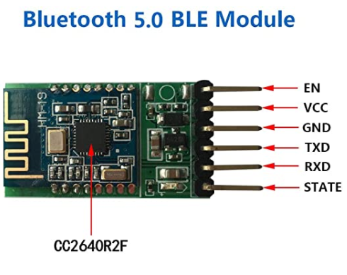

# Tarta-BLE-Beacon

This project aims to create a very light BLE beacon for my young turtle, so that I can easily find her when she's hidden under the bushes in my garden.

### She is Tarta

- The BLE Radio Beacon attached to the "poor" Tarta.

### Components

- The BLE 5.0 HM-19 modul by DSD-Tech.

